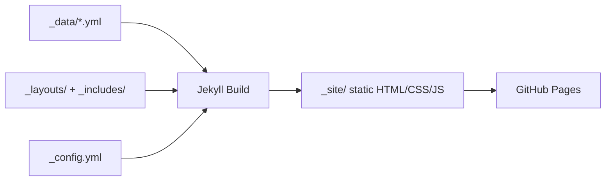

# Design Document: Jekyll CV Website

## Overview

Jekyll CV Website là một static site được xây dựng bằng Jekyll — static site generator được GitHub Pages hỗ trợ chính thức. Website hiển thị CV cá nhân gồm các section: About, Experience, Education, Skills, Projects. Toàn bộ nội dung được quản lý qua các file YAML trong thư mục `_data/`, giúp tách biệt nội dung khỏi template.

Các tính năng nổi bật:
- **Data-driven content**: Nội dung CV được đọc từ `_data/*.yml`, không cần sửa HTML.
- **Multilingual UI**: Hỗ trợ 3 ngôn ngữ (vi/en/zh) qua `_data/i18n.yml` và JavaScript client-side, lưu preference vào `localStorage`.
- **Responsive layout**: CSS media queries cho desktop (≥768px) và mobile (<768px).
- **Print & PDF export**: Print stylesheet (`@media print`) và `html2pdf.js` client-side để xuất PDF.
- **GitHub Pages ready**: Cấu hình `_config.yml` và `Gemfile` tương thích với GitHub Pages build environment.

### Công nghệ sử dụng

| Layer | Công nghệ |
|---|---|
| Static site generator | Jekyll (Ruby) |
| Hosting | GitHub Pages |
| Templating | Liquid + HTML |
| Styling | CSS3 (media queries, CSS variables) |
| Scripting | Vanilla JavaScript (ES6+) |
| PDF export | html2pdf.js (CDN) |
| Data | YAML (`_data/`) |
| Dependency management | Bundler + Gemfile |

---

## Architecture

### Tổng quan kiến trúc

```
jekyll-cv-website/
├── _config.yml              # Jekyll configuration
├── Gemfile                  # Ruby gem dependencies
├── .gitignore
├── README.md
├── index.html               # Entry point (uses home layout)
│
├── _layouts/
│   ├── default.html         # Base HTML structure
│   └── home.html            # CV page layout (extends default)
│
├── _includes/
│   ├── head.html            # <head> meta, CSS links
│   ├── header.html          # Name, nav, language switcher
│   ├── footer.html          # Copyright, social links
│   ├── about.html           # About section partial
│   ├── experience.html      # Experience section partial
│   ├── education.html       # Education section partial
│   ├── skills.html          # Skills section partial
│   └── projects.html        # Projects section partial
│
├── _data/
│   ├── profile.yml          # Personal info (name, title, photo, links)
│   ├── experience.yml       # Work history entries
│   ├── education.yml        # Academic history entries
│   ├── skills.yml           # Skills grouped by category
│   ├── projects.yml         # Project entries
│   └── i18n.yml             # UI labels keyed by language code
│
├── assets/
│   ├── css/
│   │   └── main.css         # Main stylesheet (responsive + print)
│   └── js/
│       └── main.js          # Language switcher + PDF export logic
│
└── _site/                   # Generated output (git-ignored)
```

### Luồng build



### Luồng runtime (client-side)

```mermaid
flowchart TD
    A[Page Load] --> B{localStorage có lang?}
    B -- Có --> C[Áp dụng ngôn ngữ đã lưu]
    B -- Không --> D[Áp dụng ngôn ngữ mặc định: vi]
    C --> E[Render UI labels từ i18n data]
    D --> E
    E --> F[User tương tác]
    F --> G{Hành động}
    G -- Click language button --> H[Cập nhật labels + lưu localStorage]
    G -- Click Print CV --> I[window.print()]
    G -- Click Export PDF --> J[html2pdf.js generate PDF]
    J --> K[Auto download file]
```

---

## Components and Interfaces

### 1. Jekyll Configuration (`_config.yml`)

```yaml
title: "Nguyen Van A - CV"
description: "Personal CV website"
baseurl: "/jekyll-cv-website"   # repository name
url: "https://username.github.io"
theme: minima                    # hoặc custom theme
markdown: kramdown
plugins:
  - jekyll-feed
```

**Trách nhiệm**: Cấu hình toàn bộ Jekyll build, đặc biệt `baseurl` để asset paths hoạt động đúng trên GitHub Pages.

### 2. Layouts

#### `_layouts/default.html`
- Cấu trúc HTML cơ bản: `<!DOCTYPE html>`, `<html>`, `<head>`, `<body>`
- Include `head.html`, `header.html`, `{{ content }}`, `footer.html`
- Load `main.css` và `main.js`

#### `_layouts/home.html`
- Extends `default.html` (front matter: `layout: default`)
- Render các section includes theo thứ tự: about → experience → education → skills → projects
- Chứa nút "Print CV" và "Export PDF"

### 3. Includes

| File | Trách nhiệm |
|---|---|
| `head.html` | `<meta>` tags, CSS link, page title |
| `header.html` | Tên người dùng, nav links đến từng section, language switcher (3 nút: VI / EN / ZH) |
| `footer.html` | Copyright, social media links |
| `about.html` | Render `site.data.profile`: name, title, photo, summary, email/linkedin/github links |
| `experience.html` | Loop qua `site.data.experience`, render từng entry |
| `education.html` | Loop qua `site.data.education`, render từng entry |
| `skills.html` | Loop qua `site.data.skills`, render category + skill list |
| `projects.html` | Loop qua `site.data.projects`, render từng project |

### 4. Data Files Interface

#### `_data/profile.yml`
```yaml
name: "Nguyen Van A"
title: "Software Engineer"
photo: "/assets/images/avatar.jpg"
summary: "Experienced software engineer..."
email: "example@email.com"       # optional → mailto: link
linkedin: "https://linkedin.com/in/..."  # optional
github: "https://github.com/..."         # optional
```

#### `_data/experience.yml`
```yaml
- title: "Senior Developer"
  company: "Company Name"
  url: "https://company.com"     # optional → company name becomes link
  start: "2020-01"
  end: "Present"                 # or "2023-06"
  responsibilities:
    - "Led development of..."
    - "Improved performance by..."
```

#### `_data/education.yml`
```yaml
- degree: "Bachelor of Computer Science"
  institution: "University Name"
  year: "2018"
  description: "GPA: 3.8/4.0"   # optional
```

#### `_data/skills.yml`
```yaml
- category: "Programming Languages"
  items:
    - "Python"
    - "JavaScript"
    - "Ruby"
- category: "Frameworks"
  items:
    - "Rails"
    - "React"
```

#### `_data/projects.yml`
```yaml
- name: "Project Alpha"
  description: "A web application that..."
  technologies:
    - "React"
    - "Node.js"
  url: "https://demo.example.com"    # optional → live demo link
  github: "https://github.com/..."   # optional → GitHub repo link
```

#### `_data/i18n.yml`
```yaml
vi:
  nav:
    about: "Giới thiệu"
    experience: "Kinh nghiệm"
    education: "Học vấn"
    skills: "Kỹ năng"
    projects: "Dự án"
  buttons:
    print: "In CV"
    export_pdf: "Xuất PDF"
    exporting: "Đang tạo..."
en:
  nav:
    about: "About"
    experience: "Experience"
    education: "Education"
    skills: "Skills"
    projects: "Projects"
  buttons:
    print: "Print CV"
    export_pdf: "Export PDF"
    exporting: "Generating..."
zh:
  nav:
    about: "关于"
    experience: "工作经历"
    education: "教育背景"
    skills: "技能"
    projects: "项目"
  buttons:
    print: "打印简历"
    export_pdf: "导出PDF"
    exporting: "生成中..."
```

### 5. JavaScript Module (`assets/js/main.js`)

#### Language Switcher

```javascript
// Interface
const I18N_DATA = { /* injected from _data/i18n.yml via Liquid */ };
const DEFAULT_LANG = 'vi';
const STORAGE_KEY = 'cv_lang';

function applyLanguage(lang: string): void
function getStoredLanguage(): string | null
function initLanguage(): void
```

**Luồng**:
1. Khi page load: đọc `localStorage.getItem(STORAGE_KEY)`, fallback về `'vi'`
2. `applyLanguage(lang)`: cập nhật tất cả elements có `data-i18n` attribute với giá trị từ `I18N_DATA[lang]`
3. Khi click language button: gọi `applyLanguage(lang)` + `localStorage.setItem(STORAGE_KEY, lang)`

#### PDF Exporter

```javascript
// Interface
function exportPDF(): Promise<void>
function getExportFilename(name: string): string  // "{name}_CV_{YYYY-MM-DD}.pdf"
```

**Luồng**:
1. Disable "Export PDF" button, đổi text thành i18n `buttons.exporting`
2. Tạo clone của CV content element, loại bỏ: nav, language switcher, print button, export button
3. Gọi `html2pdf().set(options).from(element).save(filename)`
4. Trong `finally`: restore button về trạng thái ban đầu
5. Nếu `html2pdf` không load được: hiển thị error message

**html2pdf.js options**:
```javascript
{
  margin: 10,           // 10mm all sides
  filename: exportFilename,
  image: { type: 'jpeg', quality: 0.98 },
  html2canvas: { scale: 2 },
  jsPDF: { unit: 'mm', format: 'a4', orientation: 'portrait' },
  pagebreak: { avoid: '.cv-entry' }  // avoid page breaks inside entries
}
```

### 6. CSS Architecture (`assets/css/main.css`)

```
main.css
├── CSS Variables (colors, fonts, spacing)
├── Base styles (reset, typography)
├── Layout (header, main, footer)
├── Section styles (about, experience, education, skills, projects)
├── Language switcher styles
├── Button styles (print, export)
├── @media (max-width: 767px) — mobile layout
└── @media print — print stylesheet
```

**Print stylesheet** (`@media print`):
- Ẩn: `nav`, `.language-switcher`, `.btn-print`, `.btn-export`
- Single column layout
- Black text on white background
- `a[href]::after { content: " (" attr(href) ")"; }` — hiển thị URL
- `page-break-inside: avoid` trên `.cv-entry`
- `@page { size: A4; margin: 15mm; }`

---

## Data Models

### Profile Model

```typescript
interface Profile {
  name: string;           // required
  title: string;          // required
  photo?: string;         // optional, path to image
  summary: string;        // required
  email?: string;         // optional
  linkedin?: string;      // optional, full URL
  github?: string;        // optional, full URL
}
```

### Experience Entry Model

```typescript
interface ExperienceEntry {
  title: string;          // job title, required
  company: string;        // company name, required
  url?: string;           // optional, company website
  start: string;          // "YYYY-MM" format
  end: string;            // "YYYY-MM" or "Present"
  responsibilities: string[];  // list of bullet points
}
```

### Education Entry Model

```typescript
interface EducationEntry {
  degree: string;         // required
  institution: string;    // required
  year: string;           // graduation year
  description?: string;   // optional, GPA or notes
}
```

### Skill Category Model

```typescript
interface SkillCategory {
  category: string;       // category name, required
  items: string[];        // list of skills, required
}
```

### Project Entry Model

```typescript
interface ProjectEntry {
  name: string;           // required
  description: string;    // required
  technologies: string[]; // required
  url?: string;           // optional, live demo
  github?: string;        // optional, GitHub repo
}
```

### I18n Model

```typescript
interface I18nData {
  [langCode: string]: {   // "vi" | "en" | "zh"
    nav: {
      about: string;
      experience: string;
      education: string;
      skills: string;
      projects: string;
    };
    buttons: {
      print: string;
      export_pdf: string;
      exporting: string;
    };
  };
}
```

### Export Filename

Format: `{name}_CV_{YYYY-MM-DD}.pdf`

- `{name}`: Giá trị `profile.name`, spaces replaced với underscores
- `{YYYY-MM-DD}`: Ngày hiện tại tại thời điểm export (client-side `new Date()`)

Ví dụ: `Nguyen_Van_A_CV_2024-01-15.pdf`

---

## Correctness Properties

*A property is a characteristic or behavior that should hold true across all valid executions of a system — essentially, a formal statement about what the system should do. Properties serve as the bridge between human-readable specifications and machine-verifiable correctness guarantees.*

### Property 1: Profile data rendering completeness

*For any* valid profile data object (with name, title, summary fields), the rendered About section HTML should contain the name, title, and summary values as visible text content.

**Validates: Requirements 3.1, 3.2**

---

### Property 2: Optional profile links render conditionally

*For any* profile data object, if the object contains an `email` field then the rendered HTML should contain a `mailto:` link with that email; if it contains a `linkedin` field then the rendered HTML should contain a link to that LinkedIn URL; if it contains a `github` field then the rendered HTML should contain a link to that GitHub URL. Conversely, if a field is absent, no corresponding link should appear.

**Validates: Requirements 3.3, 3.4, 3.5**

---

### Property 3: Chronological sections render in reverse order

*For any* list of experience or education entries with distinct dates, the rendered HTML section should display entries in reverse chronological order (most recent entry appears first in the DOM).

**Validates: Requirements 4.1, 5.1**

---

### Property 4: CV entry rendering completeness

*For any* valid CV entry (experience, education, skill category, or project), the rendered HTML for that entry should contain all required fields: experience entries must contain title, company, period, and all responsibilities; education entries must contain degree, institution, and year; skill categories must contain category name and all skill items; project entries must contain name, description, and all technologies.

**Validates: Requirements 4.2, 4.3, 5.2, 5.3, 6.2, 6.3, 7.1, 7.2, 7.3**

---

### Property 5: Optional URL fields render as hyperlinks

*For any* experience entry with a `url` field, the rendered company name should be wrapped in an anchor tag pointing to that URL. *For any* project entry with a `url` field, the rendered HTML should contain an anchor tag pointing to that URL. *For any* project entry with a `github` field, the rendered HTML should contain an anchor tag pointing to that GitHub URL.

**Validates: Requirements 4.4, 7.4, 7.5**

---

### Property 6: Language switch updates all UI labels

*For any* supported language code (`vi`, `en`, `zh`), after calling `applyLanguage(lang)`, every DOM element with a `data-i18n` attribute should have its text content updated to the corresponding value from the i18n data for that language code.

**Validates: Requirements 11.3, 11.5**

---

### Property 7: Language preference localStorage round-trip

*For any* supported language code, after a visitor selects that language (triggering `localStorage.setItem`), a subsequent call to `initLanguage()` (simulating page reload) should apply that same language — i.e., `getStoredLanguage()` returns the stored code and `applyLanguage` is called with it.

**Validates: Requirements 11.6, 11.7**

---

### Property 8: Language switch does not affect CV content

*For any* supported language code switch, the text content of CV data elements (job descriptions, project descriptions, skill items, education descriptions) — i.e., elements that do NOT have a `data-i18n` attribute — should remain unchanged before and after the language switch.

**Validates: Requirements 11.8**

---

### Property 9: Export filename format

*For any* profile name string and any date, the `getExportFilename(name, date)` function should return a string matching the pattern `{sanitized_name}_CV_{YYYY-MM-DD}.pdf`, where `{sanitized_name}` is the name with spaces replaced by underscores and `{YYYY-MM-DD}` is the ISO date string of the provided date.

**Validates: Requirements 13.5**

---

### Property 10: Export button state restoration invariant

*For any* PDF export attempt — whether it succeeds or throws an error — the "Export PDF" button should always be restored to its original enabled state with its original label text after the operation completes (i.e., the `finally` block always executes the restore logic).

**Validates: Requirements 13.8**

---

### Property 11: PDF export excludes UI elements

*For any* page state, the HTML element passed to `html2pdf()` during PDF generation should not contain the navigation bar, the language switcher, the "Print CV" button, or the "Export PDF" button — these elements must be excluded from the cloned content before PDF generation.

**Validates: Requirements 13.9**

---

## Error Handling

### Jekyll Build Errors

| Tình huống | Hành vi mong đợi |
|---|---|
| `_data/profile.yml` bị thiếu | Jekyll build thất bại với error message rõ ràng chỉ ra file bị thiếu |
| `_data/experience.yml` bị thiếu | Jekyll build thất bại với error message rõ ràng |
| YAML syntax error trong data file | Jekyll build thất bại với line number và file name |
| Liquid template error | Jekyll build thất bại với template error message |

**Cách xử lý**: Sử dụng Liquid `` guards trong templates để tránh nil reference errors. Thêm validation comments trong data files để hướng dẫn người dùng.

### JavaScript Runtime Errors

| Tình huống | Hành vi mong đợi |
|---|---|
| `html2pdf.js` không load được (CDN fail) | Hiển thị error message: "PDF export không khả dụng. Vui lòng dùng 'In CV'." |
| PDF generation thất bại (exception) | Restore button state, hiển thị error message |
| `localStorage` không khả dụng (private browsing) | Fallback về default language `vi`, không crash |
| `_data/i18n.yml` thiếu key | Fallback về key name, không crash |

**Cách xử lý**:
```javascript
// localStorage fallback
function getStoredLanguage() {
  try {
    return localStorage.getItem(STORAGE_KEY);
  } catch (e) {
    return null; // private browsing mode
  }
}

// html2pdf availability check
function exportPDF() {
  if (typeof html2pdf === 'undefined') {
    showError('PDF export không khả dụng. Vui lòng dùng "In CV".');
    return;
  }
  // ...
}
```

### CSS/Responsive Errors

| Tình huống | Hành vi mong đợi |
|---|---|
| Ảnh profile không load được | Hiển thị alt text, layout không bị vỡ |
| Font không load được | Fallback về system fonts |

---

## Testing Strategy

### Tổng quan

Feature này sử dụng **dual testing approach**:
- **Unit tests**: Kiểm tra các hàm JavaScript cụ thể (language switcher, PDF filename generation, button state management)
- **Property-based tests**: Kiểm tra các universal properties trên nhiều inputs (rendering completeness, language switching, filename format)
- **Smoke tests**: Kiểm tra file existence và configuration
- **Integration tests**: Kiểm tra Jekyll build process

### Property-Based Testing

**Thư viện**: [fast-check](https://github.com/dubzzz/fast-check) (JavaScript/TypeScript)

**Cấu hình**: Minimum 100 iterations per property test.

**Tag format**: `// Feature: jekyll-cv-website, Property {N}: {property_text}`

#### Property Tests

**Property 1: Profile data rendering completeness**
```javascript
// Feature: jekyll-cv-website, Property 1: Profile data rendering completeness
fc.assert(fc.property(
  fc.record({ name: fc.string({ minLength: 1 }), title: fc.string({ minLength: 1 }), summary: fc.string({ minLength: 1 }) }),
  (profile) => {
    const html = renderAboutSection(profile);
    return html.includes(profile.name) && html.includes(profile.title) && html.includes(profile.summary);
  }
), { numRuns: 100 });
```

**Property 2: Optional profile links render conditionally**
```javascript
// Feature: jekyll-cv-website, Property 2: Optional profile links render conditionally
fc.assert(fc.property(
  fc.record({
    name: fc.string({ minLength: 1 }),
    email: fc.option(fc.emailAddress()),
    linkedin: fc.option(fc.webUrl()),
    github: fc.option(fc.webUrl()),
  }),
  (profile) => {
    const html = renderAboutSection(profile);
    const emailOk = profile.email ? html.includes(`mailto:${profile.email}`) : !html.includes('mailto:');
    const linkedinOk = profile.linkedin ? html.includes(profile.linkedin) : true;
    const githubOk = profile.github ? html.includes(profile.github) : true;
    return emailOk && linkedinOk && githubOk;
  }
), { numRuns: 100 });
```

**Property 3: Chronological sections render in reverse order**
```javascript
// Feature: jekyll-cv-website, Property 3: Chronological sections render in reverse order
fc.assert(fc.property(
  fc.array(fc.record({ title: fc.string(), start: fc.date() }), { minLength: 2 }),
  (entries) => {
    const rendered = renderExperienceSection(entries);
    const positions = entries
      .sort((a, b) => b.start - a.start)
      .map(e => rendered.indexOf(e.title));
    return positions.every((pos, i) => i === 0 || positions[i - 1] < pos);
  }
), { numRuns: 100 });
```

**Property 6: Language switch updates all UI labels**
```javascript
// Feature: jekyll-cv-website, Property 6: Language switch updates all UI labels
fc.assert(fc.property(
  fc.constantFrom('vi', 'en', 'zh'),
  (lang) => {
    applyLanguage(lang);
    const elements = document.querySelectorAll('[data-i18n]');
    return Array.from(elements).every(el => {
      const key = el.getAttribute('data-i18n');
      return el.textContent === getI18nValue(lang, key);
    });
  }
), { numRuns: 100 });
```

**Property 9: Export filename format**
```javascript
// Feature: jekyll-cv-website, Property 9: Export filename format
fc.assert(fc.property(
  fc.string({ minLength: 1 }),
  fc.date(),
  (name, date) => {
    const filename = getExportFilename(name, date);
    const sanitizedName = name.replace(/\s+/g, '_');
    const dateStr = date.toISOString().split('T')[0];
    return filename === `${sanitizedName}_CV_${dateStr}.pdf`;
  }
), { numRuns: 100 });
```

**Property 10: Export button state restoration invariant**
```javascript
// Feature: jekyll-cv-website, Property 10: Export button state restoration invariant
fc.assert(fc.property(
  fc.boolean(), // true = success, false = failure
  async (shouldSucceed) => {
    mockHtml2pdf(shouldSucceed);
    const button = createMockButton();
    await exportPDF(button);
    return button.disabled === false && button.textContent === originalButtonText;
  }
), { numRuns: 100 });
```

### Unit Tests

- **Language switcher**: Default language is `vi`, localStorage fallback, unknown language code handling
- **PDF export**: html2pdf not available → error message, correct options passed to html2pdf
- **Build**: Jekyll build succeeds with sample data files, missing data file produces error

### Smoke Tests

- `_config.yml` tồn tại và chứa `baseurl`, `url`, `title`, `description`, `theme`
- `Gemfile` chứa `github-pages` gem
- `.gitignore` chứa `_site/`, `.jekyll-cache/`, `vendor/`, `Gemfile.lock`
- `_layouts/default.html`, `_layouts/home.html` tồn tại
- `_includes/head.html`, `header.html`, `footer.html` tồn tại
- `_data/i18n.yml` chứa keys `vi`, `en`, `zh`
- `assets/css/main.css` chứa `@media print` và `@media (max-width: 767px)` rules
- `html2pdf.js` script tag tồn tại trong HTML output

### Integration Tests

- `bundle exec jekyll build` thành công với sample data, tạo ra `_site/index.html`
- `bundle exec jekyll build` thất bại với error message khi `_data/profile.yml` bị thiếu
- Output HTML chứa đúng nội dung từ data files
